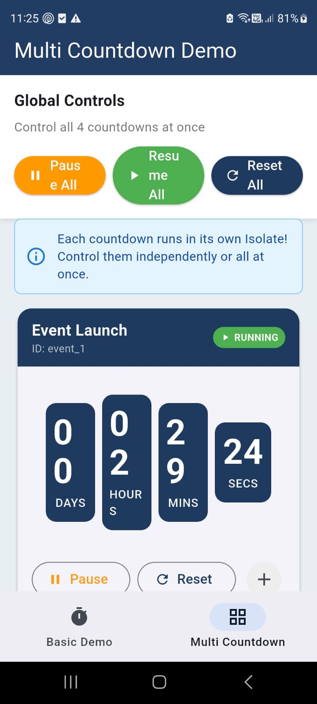

# Ejemplo de Countdown Carousel Widget

Este directorio contiene una aplicación de ejemplo completa que demuestra todas las funcionalidades del paquete `countdown_carousel_widget`.

## Ejecutar el Ejemplo

```bash
cd example
flutter pub get
flutter run
```

### Ejecutar en diferentes plataformas

```bash
# Web (usa Timer - Isolates no soportados)
flutter run -d chrome

# macOS (usa Isolate)
flutter run -d macos

# Android (usa Isolate)
flutter run -d android

# iOS (usa Isolate)
flutter run -d ios
```

## Estructura del Ejemplo

```
lib/
├── main.dart                    # Punto de entrada y navegación principal
├── demos/
│   ├── basic_demo.dart          # Demo básico con carrusel de imágenes
│   └── multi_countdown_demo.dart # Demo de múltiples countdowns independientes
└── widgets/
    ├── global_controls.dart     # Controles globales para todos los countdowns
    └── countdown_card.dart      # Tarjeta individual de countdown
```

## Demos Disponibles

### 1. Demo Básico (`BasicDemoPage`)

Demuestra el uso fundamental del widget:

- **CountdownCarouselWidget**: Widget completo con countdown y carrusel de imágenes
- **CountdownOnlyWidget**: Solo el countdown sin carrusel
- **Estilos personalizados**: Colores y etiquetas configurables
- **Callbacks**: `onAddImage`, `onImageTap`, `onImageRemove`, `onCountdownComplete`

```dart
CountdownCarouselWidget(
  targetDate: DateTime.now().add(Duration(days: 2)),
  images: _images,
  onAddImage: () => print('Agregar imagen'),
  onCountdownComplete: () => print('¡Completado!'),
)
```

### 2. Demo Multi-Countdown (`MultiCountdownDemoPage`)

Demuestra la capacidad de ejecutar múltiples countdowns independientes:

- **ControllableCountdownController**: Controlador individual por countdown
- **GlobalCountdownManager**: Gestión centralizada de todos los countdowns
- **Controles individuales**: Pausar, reanudar, reiniciar cada countdown
- **Controles globales**: Pausar/reanudar/reiniciar todos a la vez
- **Isolates independientes**: Cada countdown se ejecuta en su propio Isolate

```dart
// Crear controlador individual
final controller = ControllableCountdownController(
  id: 'mi_countdown',
  targetDate: DateTime.now().add(Duration(hours: 2)),
  useIsolate: true,
);

// Registrar en manager global
final manager = GlobalCountdownManager();
manager.register(controller);

// Controlar todos a la vez
manager.pauseAll();
manager.resumeAll();
manager.resetAll();
```

## Características Demostradas

| Característica | Demo Básico | Multi-Countdown |
|----------------|:-----------:|:---------------:|
| Countdown simple | ✅ | ✅ |
| Carrusel de imágenes | ✅ | ❌ |
| Estilos personalizados | ✅ | ✅ |
| Múltiples countdowns | ❌ | ✅ |
| Pausar/Reanudar | ❌ | ✅ |
| Control global | ❌ | ✅ |
| Isolates independientes | ✅ | ✅ |

## Soporte de Plataformas

El ejemplo detecta automáticamente la plataforma y usa la implementación apropiada:

| Plataforma | Implementación | Comando |
|------------|----------------|---------|
| Android | Isolate | `flutter run -d android` |
| iOS | Isolate | `flutter run -d ios` |
| macOS | Isolate | `flutter run -d macos` |
| Windows | Isolate | `flutter run -d windows` |
| Linux | Isolate | `flutter run -d linux` |
| **Web** | **Timer** | `flutter run -d chrome` |

## Verificar Implementación

Puedes verificar qué implementación está usando tu aplicación:

```dart
import 'package:countdown_carousel_widget/countdown_carousel_widget.dart';

// Verificar soporte de Isolates
if (CountdownManagerFactory.isolatesSupported) {
  print('Ejecutando con Isolates');
} else {
  print('Ejecutando con Timer (web)');
}
```

## Capturas de Pantalla

### Multi-Countdown Demo (Android)



## Recursos Adicionales

- [Documentación del paquete](https://pub.dev/packages/countdown_carousel_widget)
- [Repositorio GitHub](https://github.com/juansuarez-pragma/prg_timer)
- [Reporte de problemas](https://github.com/juansuarez-pragma/prg_timer/issues)
